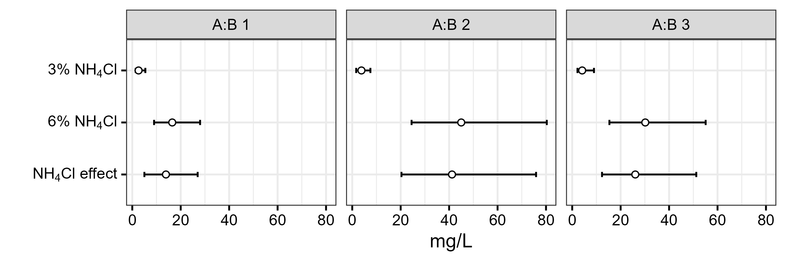

```{r, echo=FALSE, results='hide'}
knitr::opts_chunk$set(message = FALSE,  
                      warning = FALSE)   
```

# Import

```{r}
library(readxl)
df <- read_excel("data.xlsx")
df <- as.data.frame(df)
df
```

```{r}
df$CHI_TIEU <- factor(df$CHI_TIEU,
                   levels = rev(c("TREAT1",
                              "TREAT2",
                              "EFFECT")))
```

# Plot

```{r, fig.show="hide"}
library(ggplot2)

p1 <- ggplot(data = df,
       mapping = aes(x = VALUE,
                     y = CHI_TIEU)) +
  
  geom_errorbar(mapping = aes(xmin = LOWER_CI,
                              xmax = UPPER_CI),
                width = 0.1) +
  
  geom_point(shape = 21,
             color = "black",
             fill = "white") +
  
  
  
  facet_wrap(~ RATIO) +
  
  labs(x = "mg/L",
       y = "") +

  theme_bw(base_size = 16,
           ink = "black",
           paper = "white") +
  
  scale_y_discrete(breaks = c("TREAT1", "TREAT2", "EFFECT"),
                   labels = c(expression("3%"~NH[4]*Cl),
                              expression("6%"~NH[4]*Cl), 
                              expression(NH[4]*Cl~"effect"))) +

  theme(axis.title = element_text(color = "black")) +

  theme(axis.text = element_text(color = "black")) +
  
  theme(axis.ticks = element_line(color = "black")) +

  theme(strip.text = element_text(color = "black")) 
  
p1

ggsave(filename = "dot-plot.png",
       width = 9,
       height = 3,
       dpi = 300,
       units = "in")
```



# Reference

`https://themockup.blog/posts/2020-12-26-creating-and-using-custom-ggplot2-themes/`

**Để vẽ được các đồ thị khoa học đạt chuẩn công bố quốc tế, bạn có thể tham gia lớp R for Data Science do mình trực tiếp hướng dẫn.** [**Thông tin chi tiết**](https://www.tuhocr.com/training)


