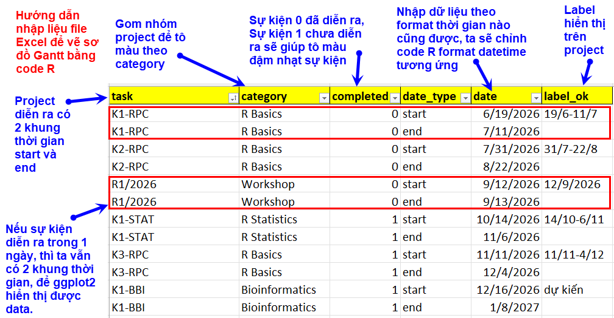
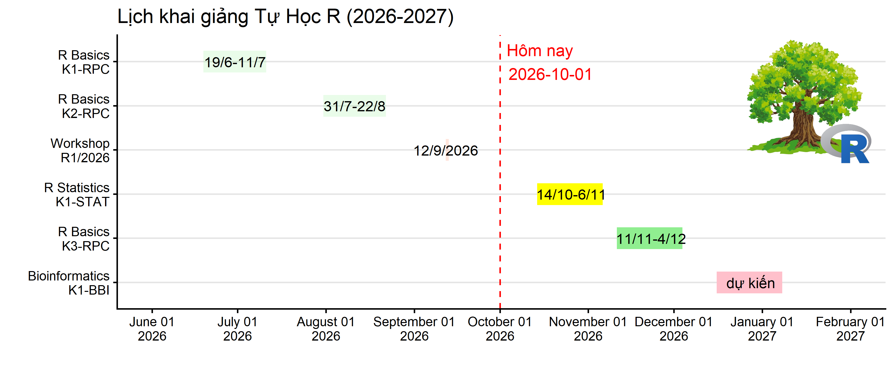

```{r, echo=FALSE, results='hide'}
knitr::opts_chunk$set(message = FALSE,  
                      warning = FALSE)   
```

# Import dataset

Quy trình sau giúp vẽ sơ đồ Gantt để trực quan hóa tiến độ các dự án theo thời gian, mình thiết kế code đơn giản để thuận tiện các bạn modify thêm dựa trên khung template này. [Download file Excel template](https://thongkevavedothi.com/blog/huong-dan-ve-so-do-gantt/df_tidy.xlsx)

Để thuận tiện đọc code và modify template, bạn tham khảo các bài giảng R ở đây nhé. <https://class.tuhocr.com/>



```{r}
library(tidyverse)
library(readxl)
library(forcats)

df_tidy <- read_xlsx("df_tidy.xlsx")

df_tidy <- as.data.frame(df_tidy)

df_tidy$completed <- as.character(df_tidy$completed)

df_tidy
```

```{r}
df_tidy$task <- paste0(df_tidy$category, "\n", df_tidy$task)
```

```{r}
df_tidy$date <- as.Date(df_tidy$date)

sapply(df_tidy,
       class)
```

# Set ngày giờ cho trục X

```{r}
start_date <- as.Date("2026-06-01")
end_date <- as.Date("2027-02-01")
```

# Set label cho các task

```{r}
date_label <- seq(from = start_date,
                  to = end_date,
                  by = "month")

date_label_ok <- format(date_label,
                        format = "%B %d\n%Y")
```

```{r}
df_label_1 <- df_tidy |> subset(date_type == "start")

df_label_2 <- df_tidy |> subset(date_type == "end")

df_label_2

df_label_1$date_end <- df_label_2$date

df_label_1$date <- df_label_1$date + (df_label_1$date_end - df_label_1$date) / 2

df_label_1 -> df_label
```

# Vẽ đồ thị

```{r}
p <- ggplot() +
  
  geom_line(data = df_tidy, 
            mapping = aes(x = fct_rev(fct_inorder(task)),
                          y = date,
                          color = category, 
                          alpha = completed),
            size = 10) +
  
  geom_hline(yintercept = as.Date("2026-10-01"),
             colour="red",
             linetype="dashed") +
  
  annotate("text", 
           x = 6, # điều chỉnh vị trí text
           y = as.Date("2026-10-01"), 
           label = "Hôm nay\n2026-10-01",
           color = "red",
           hjust = -0.1) +
  
  geom_text(data = df_label, 
            mapping = aes(x = fct_rev(fct_inorder(task)),
                          y = date,
                          label = label_ok),
            hjust = 0.5,
            size = 5) +

  coord_flip() +
  
  scale_color_manual(values = c("pink", "lightgreen", "yellow", "coral")) +
  
  scale_alpha_discrete(range=c(0.2, 1),
                       guide="none") +
  
  scale_y_date(
               limits = c(start_date, end_date),
               breaks = date_label,
               labels = date_label_ok)  +
  
  labs(title = "Lịch khai giảng Tự Học R (2026-2027)",
       x = "",
       y = "",
       colour = "Chuyên đề") +
  
  theme_classic(base_size = 16) +
  
  theme(axis.text.x = element_text(angle = 0),
        
        panel.grid.minor = element_line(colour="white", 
                                        size=0.5),
        
        legend.position = "none",
        
        plot.title = element_text(hjust = 0)) +
  
  theme(panel.grid.major.y = element_line(color = "gray90"))

# p

png(filename = "gantt_ok.png",
    width = 12,
    height = 5,
    units = "in",
    res = 300)


p

library(grid)
library(gridExtra)
library(png)  
logor <- readPNG("logo.png")
 
logor -> m
 
w <- matrix(rgb(m[, , 1], m[, , 2], m[, , 3], m[, , 4] * 1), 
            nrow = dim(m)[1])
 
grid.raster(w, x = 0.9, y = 0.74, width = 0.15)  


dev.off()
```

[**Để phóng lớn hình ảnh, bạn right-click vào hình chọn *Open image in new tab*.**]{style="color:#006600"}




Tham khảo `https://jtr13.github.io/cc19/gantt-charts.html`