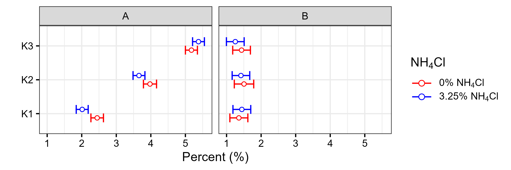

```{r, echo=FALSE, results='hide'}
knitr::opts_chunk$set(message = FALSE,  
                      warning = FALSE)   
```

# Import

```{r}
library(readxl)
df <- read_excel("data_group.xlsx")

df <- as.data.frame(df)

df
```

# Plot

```{r, fig.show='hide'}
library(ggplot2)

p1 <- ggplot(data = df,
       mapping = aes(x = VALUE,
                     y = GROUP2,
                     color = GROUP3)) +
  
   geom_errorbar(mapping = aes(xmin = LOWER_CI,
                              xmax = UPPER_CI),
                 position = position_dodge2(width = 1),
                 lineend = "square",
                width = 0.5,
                show.legend = T) +
  
  geom_point(shape = 21,
             fill = "white",
             position = position_dodge2(width = 0.5)
             ) +
  
 scale_color_manual(values = c("red", "blue"),
                    name = expression(NH[4]*Cl),
                    labels = c(expression("0%"~NH[4]*Cl),
                              expression("3.25%"~NH[4]*Cl)
                              )) +
  
  guides(color = guide_legend(override.aes = list(size = 3))) +
  
  facet_wrap(~ GROUP1,
             scales = "fixed") +
  
  labs(x = "Percent (%)",
       y = "") +
  
  theme_bw(base_size = 16) +

  theme(axis.title = element_text(color = "black")) +

  theme(axis.text = element_text(color = "black")) +
  
  theme(axis.ticks = element_line(color = "black")) +

  theme(strip.text = element_text(color = "black")) +
  
  theme(legend.key.width = unit(1, "cm"))

p1

ggsave(filename = "dot-plot-group.png",
       plot = p1,
       width = 9,
       height = 3,
       dpi = 300,
       units = "in")
```



**Để vẽ được các đồ thị khoa học đạt chuẩn công bố quốc tế, bạn có thể tham gia lớp R for Data Science do mình trực tiếp hướng dẫn.** [**Thông tin chi tiết**](https://www.tuhocr.com/training)


